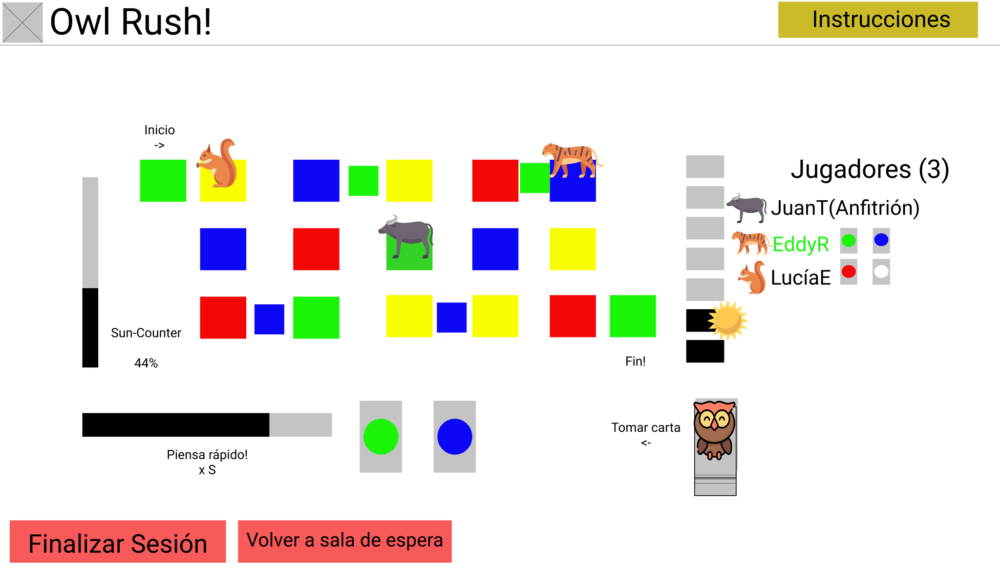

# ¡Bienvenidos al repositorio de Owl Rush!

## Owl Rush, el juego de mesa en línea que se inspira en Hoot Owl Hoot, **sin fines de lucro**.

### ¿Qué es Owl Rush?

Owl Rush es un juego de mesa en línea en el que un jugador accede como anfitrión e invita a sus amigos a jugar bajo las reglas de Hoot Owl Hoot!, con unas cuantas [modificaciones](#Modifications) hechas con el fin de darle un nuevo giro al juego.

Este juego fue creado como el proyecto grupal para el curso de [Desarollo de Aplicaciones Web de la Universidad de Costa Rica](http://jeisson.ecci.ucr.ac.cr/appweb/2021a/), en el cual los [desarrolladores](#Developers) de Owl Rush están matriculados. Reiteramos que**este proyecto no tiene fin de lucro alguno**ni pretende representar competencia alguna al juego en el que se basa

### Desarrolladores: 
- Eddy Ruiz
- Lucía Elizondo
- Juan Torres

### Modificaciones al juego de los búhos (en orden de prioridad): 

1. Sun-Counter: El sistema sun counter consiste en una barra que permite al jugador anular un avance del sol cada vez que se llena. La barra sun counter se llena por medio del pensar rápido de los participantes: Al comienzo de cada turno, justo después de que se toma una carta, una barra medida en segundos comienza a vaciarse. Esta barra representa el porcentaje de avance que hace el sun counter mientras el jugador decide su movimiento, si la barra se vacía, el jugador pierde la oportunidad de ganar avance en el sun counter, si por el contrario, el jugador realiza su movimiento rápidamente, entonces podrá llenar su sun counter con la cantidad que quede en la barra que se vacía.(!Viable)  

2. Simón dice: Para poder mover un búho de posición, el jugador tiene que repetir una secuencia de colores como en el juego de Simón dice. Si el jugador acierta la secuencia, puede dejar el búho en la posición donde se movió. Sino, el jugador pierde el turno, y se mueve el sol. Las secuencias pueden ir avanzando de dificultad conforme el juego vaya avanzando. (!Viable, premiar buena memoria.)

3. Sistema de comodines: Las cartas de colores y las cartas de sol no serían las únicas que aparecerían en el juego. Distintos tipos de modificadores (comodines) aparecerían en la baraja. Modificadores tipos cartas que dieran a elegir el color que el jugador movería, cartas que permitieran al jugador mover 2 o más búhos(complejo, sólo si da tiempo), recargas al reloj mágico (en caso de que fuera viable mantener comodines y reloj), entre otros. (!Balance, añadir cartas que sean desventajas.)

### Prototipo de tablero para el juego (por modificar dentro de poco)

