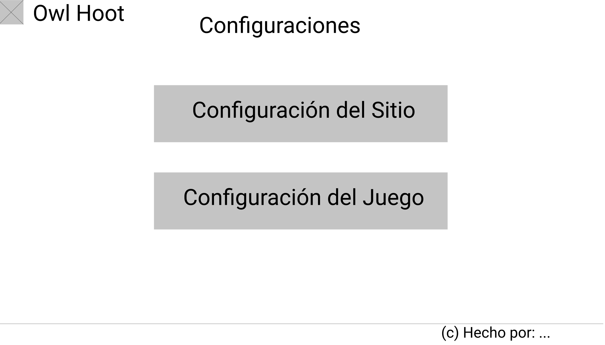
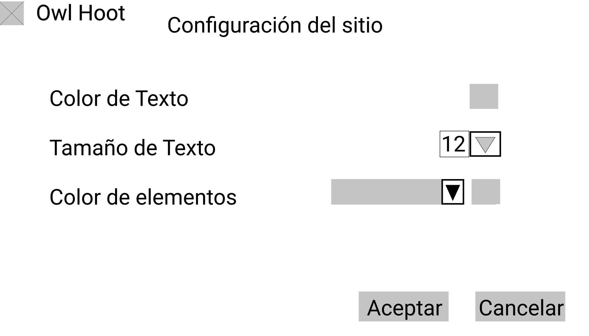
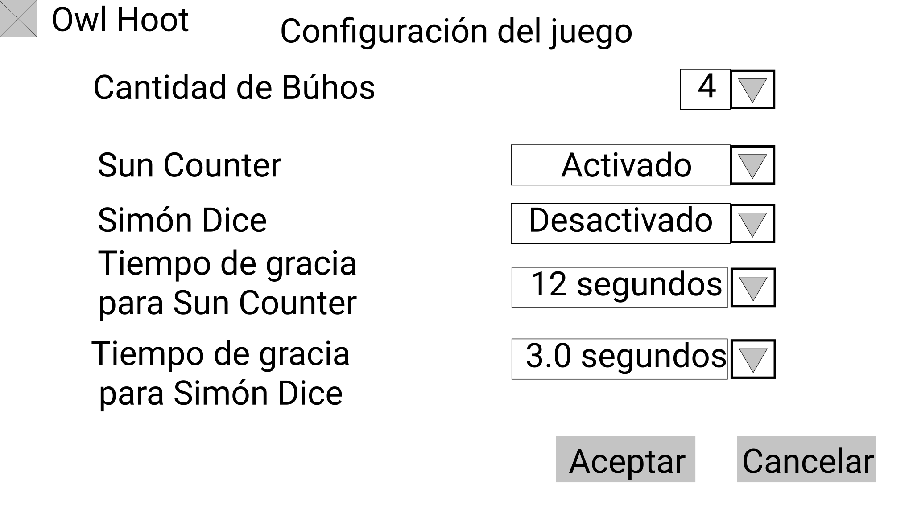

# Mapa de sitio.
1. Página principal.
    1. Desde ella se accede a los overlays Créditos e Instrucciones.
    2. Desde ella se puede acceder a la sala de espera como anfitrión que organiza o como invitado que ingresa
2. Sala de espera.
    1. Desde ella se accede al tablero para todos los jugadores que se hayan unido a la sesión, cuando el anfitrión haga click en Iniciar partida.
    2. Desde ella se accede a los overlays Ajustes de juego e Instrucciones.
    3. Desde ella se puede regresar a la página principal. (Haciendo click en Finalizar sesión en el caso de anfitriones o en Salir de la sesión en el caso de invitados)
3. Tablero de juego.
    1. Una vez en el juego, el anfitrión puede volver a la sala de espera en caso de quiera hacer algún ajuste adicional. También volverá a la sala de espera junto con el resto de jugadores si hace click en Jugar de nuevo cuando se acaba la partida.
    2. El anfitrión y sus invitados volverán a la pagina principal si el primero hace click en Finalizar partida en cualquier momento o a Volver al menú principal cuando se acabe la partida.
    3. Desde él se accede a los overlays Resultado de la partida (que aparece cuando se acaba el juego) e Instrucciones.

# Explicación: Diseño de wireframes

## Inicio
- En esta pantalla el usuario puede navegar a los otros sitios que se encuentran en la página. 
- El usuario va a poder escoger entre: crear una sesión nueva, unirse a una sesión ya existente, o salirse. 

## Acerca de 
- En esta pantalla se despliega información acerca del juego, quiénes son los integrantes. 

## Cómo jugar 
- En esta pantalla se despliegan las reglas del juego. 
- La idea es que el usuario pueda ver la relga del juego con una imagen asociada. 
- El usuario puede navegar a través de las reglas con las flechas presentadas en el carrusel. 

## Sala de espera: Invitado

- En la sala de espera, el invitado esperaría a que el anfitrión iniciara la partida.
- El invitado sería capaz de indicarle al anfitrión que está listo al dar click al botón que dice "Estoy listo".
- En la esquina superior derecha, está el botón "Regresar", que le permite al invitado abandonar la sesión.
- El listado en la izquierda indica cuántos jugadores se han unido a la sesión, junto con sus nombres de usuario.

## Sala de espera: Anfitrión
- El anfitrión usaría el botón "Invitar" para enviar su invitación a otros jugadores.
- El anfitrión usaría el botón "Iniciar partida" para comenzar a jugar. El botón sólo se habilita cuando el anfitrión consigue que una mínimo un jugador aparte de él. Una alerta aparece bajo el botón cuando esta condición no se cumple.
- En la esquina superior derecha, está el botón "Regresar", que le permite al anfitrión abandonar la sesión.
- El listado en la izquierda indica cuántos jugadores se han unido a la sesión, junto con sus nombres de usuario.

## Configuraciones
- El anfitrión podra acceder a la configuración para cambios esteticos del sitio por el botón Configuración del Sitio, y para cambios en modo de juego por el botón Configuración del Juego.

## Configuración del sitio
- Anfitrión podrá cambiar colores y tamaño de varios textos en el sitio.
- Anfitrión podrá cambiar los colores de varios elementos del 
tablero.
- Cambios serán aceptados por el botón aceptar, y no se realizaran 
por el botón cancelar

## Configuración del juego
- Anfitrión podra realizar varios cambios al modo de juego en el 
tablero.
- Permite cambio a una cantidad de búhos en el juego, limitado a una selección.
- Permite habilitar o deshabilitar el Sun Counter para el juego.
- Permite habilitar o deshabilitar el Simón Dice para el juego.
- Permite determinar el tiempo de respuesta dada al jugador para
poder usar el Sun Counter.
- Permite determinar el tiempo de respuesta dada al jugador para
poder usar el Simón Dice.

## Tablero
- La barra sun-counter y su progreso actual se encuentra a la izquierda.
- En la esquina inferior izquierda, se encuentra el tiempo que posee el usuario para tomar una decisión, así como la cantidad de progreso de sun counter que tomará al terminar su movida.
- La espiral en el centro representa las casillas del tablero. La cajita con x representa al búho al comienzo de la partida.
- Las barritas a la derecha indican el progreso del sol. La cajita x al lado de las barritas, una imagen de un sol.
- En la parte inferior de la pantalla están las cartas que el jugador posee, así como la baraja de cartas de donde el jugador toma al inicio de cada turno.

## Resultados finales
- El mensaje entre corchetes dirá si los jugadores perdieron o ganaron.
- Los mensajes crit entre corchetes serán los criterios que determinarán qué jugadores rindieron mejor.
- El jugador tendrá la posibilidad de de volver a jugar otra partida o de volver al menú principal

