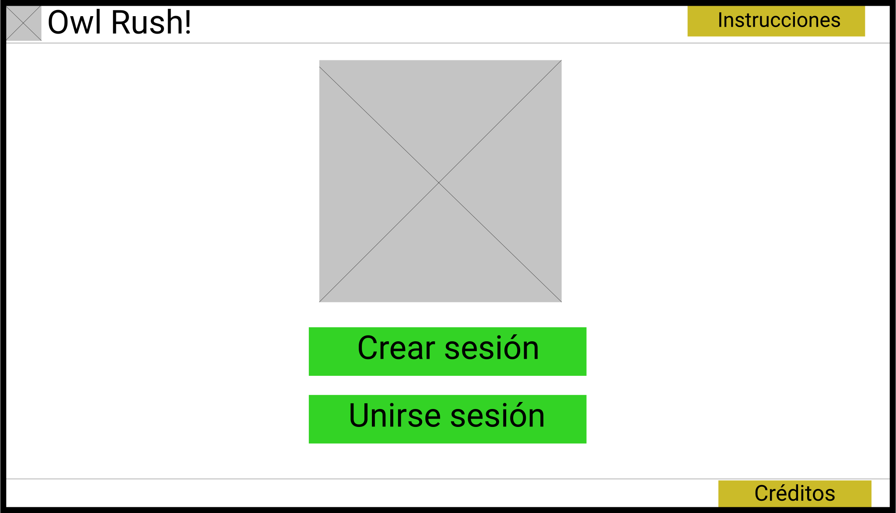
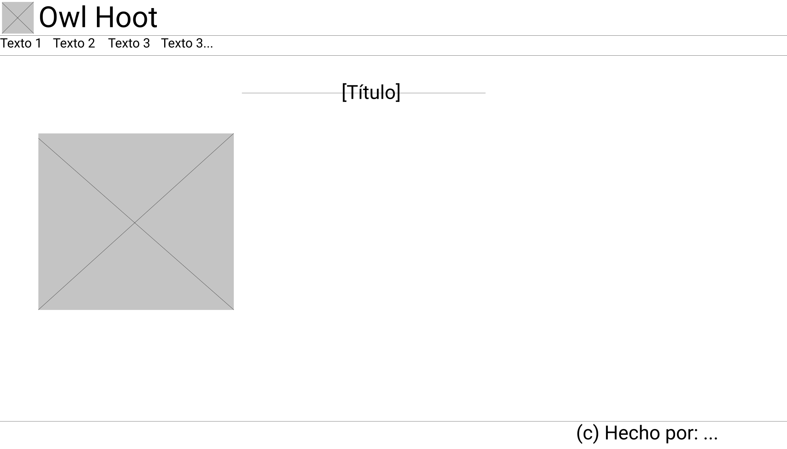
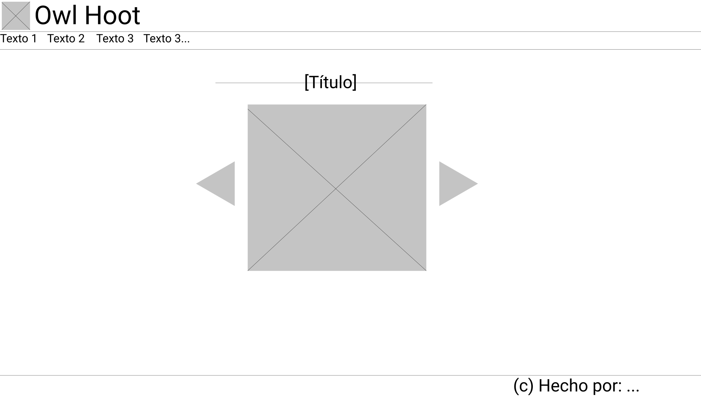
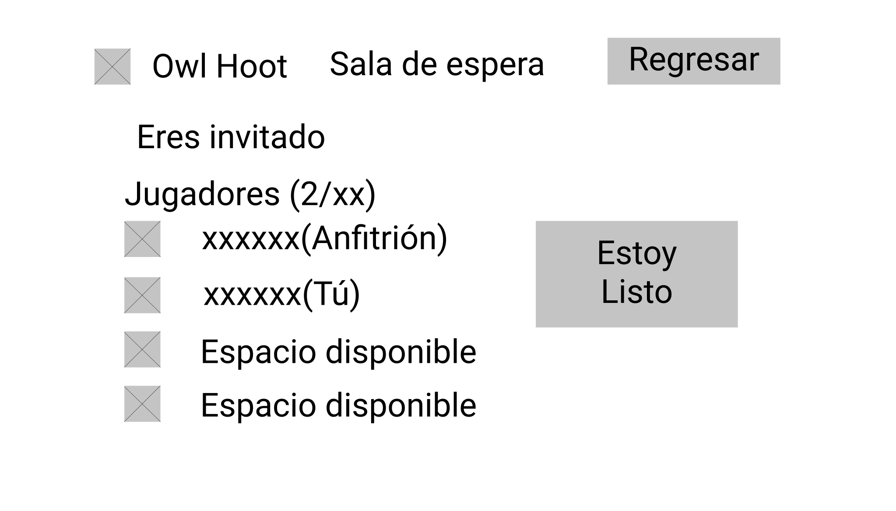
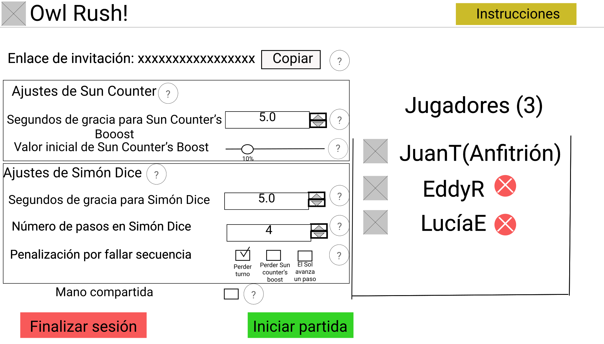

# Explicación: Diseño de wireframes

## Inicio
- En esta pantalla el usuario puede navegar a los otros sitios que se encuentran en la página. 
- El usuario va a poder escoger entre: crear una sesión nueva, unirse a una sesión ya existente, o salirse. 

## Acerca de 
- En esta pantalla se despliega información acerca del juego, quiénes son los integrantes. 

## Cómo jugar 
- En esta pantalla se despliegan las reglas del juego. 
- La idea es que el usuario pueda ver la relga del juego con una imagen asociada. 
- El usuario puede navegar a través de las reglas con las flechas presentadas en el carrusel. 

## Sala de espera: Invitado

- En la sala de espera, el invitado esperaría a que el anfitrión iniciara la partida.
- El invitado sería capaz de indicarle al anfitrión que está listo al dar click al botón que dice "Estoy listo".
- En la esquina superior derecha, está el botón "Regresar", que le permite al invitado abandonar la sesión.
- El listado en la izquierda indica cuántos jugadores se han unido a la sesión, junto con sus nombres de usuario.

## Sala de espera: Anfitrión
- El anfitrión usaría el botón "Invitar" para enviar su invitación a otros jugadores.
- El anfitrión usaría el botón "Iniciar partida" para comenzar a jugar. El botón sólo se habilita cuando el anfitrión consigue que una mínimo un jugador aparte de él. Una alerta aparece bajo el botón cuando esta condición no se cumple.
- En la esquina superior derecha, está el botón "Regresar", que le permite al anfitrión abandonar la sesión.
- El listado en la izquierda indica cuántos jugadores se han unido a la sesión, junto con sus nombres de usuario.

