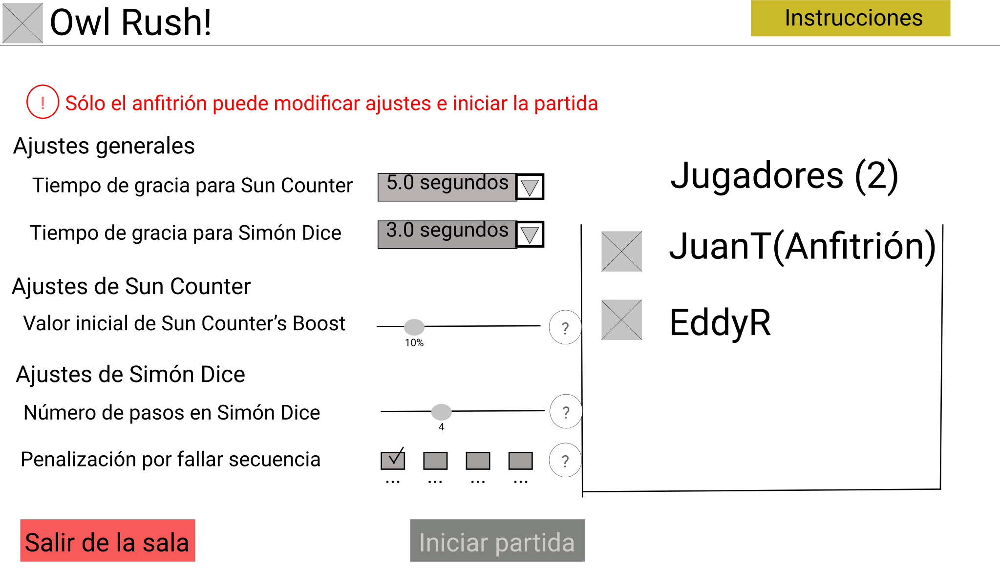
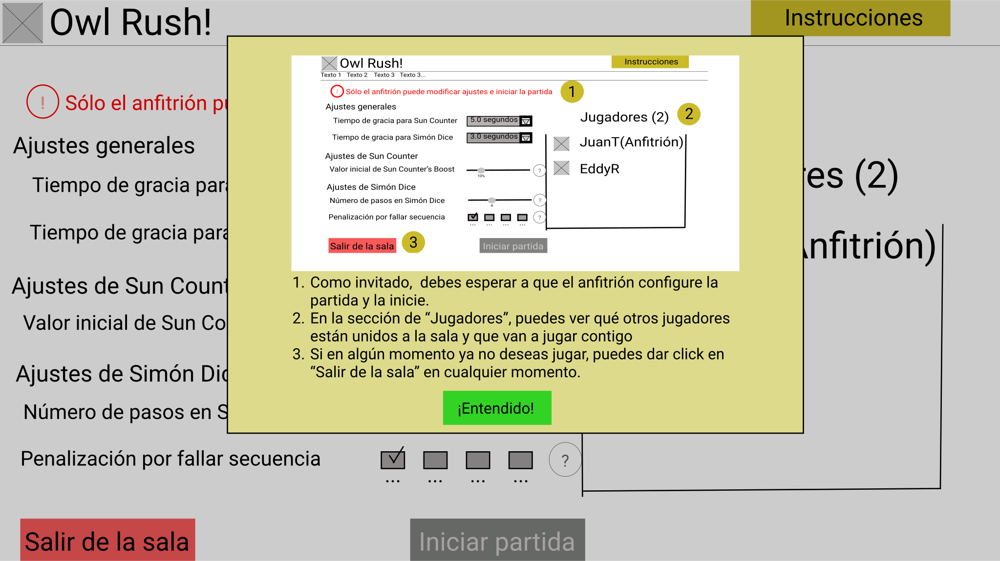

# Mapa de sitio.
1. Página principal.
    1. Desde ella se accede a los overlays Créditos e Instrucciones.
    2. Desde ella se puede acceder a la sala de espera como anfitrión que organiza o como invitado que ingresa
2. Sala de espera.
    1. Desde ella se accede al tablero para todos los jugadores que se hayan unido a la sesión, cuando el anfitrión haga click en Iniciar partida.
    2. Desde ella se accede a los overlays Ajustes de juego e Instrucciones.
    3. Desde ella se puede regresar a la página principal. (Haciendo click en Finalizar sesión en el caso de anfitriones o en Salir de la sesión en el caso de invitados)
3. Tablero de juego.
    1. Una vez en el juego, el anfitrión puede volver a la sala de espera en caso de quiera hacer algún ajuste adicional. También volverá a la sala de espera junto con el resto de jugadores si hace click en Jugar de nuevo cuando se acaba la partida.
    2. El anfitrión y sus invitados volverán a la pagina principal si el primero hace click en Finalizar partida en cualquier momento o a Volver al menú principal cuando se acabe la partida.
    3. Desde él se accede a los overlays Resultado de la partida (que aparece cuando se acaba el juego) e Instrucciones.

# Explicación: Diseño de wireframes

## Inicio
- En esta pantalla el usuario puede navegar a los otros sitios que se encuentran en la página. 
- El usuario va a poder escoger entre: crear una sesión nueva o unirse a una sesión ya existente.
- El usuario también podrá consultar los créditos del juego.
- El usuario puede consultar en cualquier momento las instrucciones para el menú principal. 

## Créditos
- En este overlay se despliega información acerca del juego, quiénes son los integrantes del equipo de desarrollo y de dónde se tomaron algunos recursos de la página. 

## Instrucciones de Menú de inicio
- En este overlay se muestran las instrucciones para el menú de inicio.

## Sala de espera: Invitado

- En la sala de espera, el invitado esperaría a que el anfitrión iniciara la partida.
- A diferencia del anfitrión, un invitado no puede ajustar reglas del juego ni comenzar la partida. Tampoco puede expulsar otros jugadores.
- Un invitado puede consultar más información sobre la pantalla que mira al hacer click al botón de instrucciones.
- En la esquina inferior izq, está el botón "Salir de la sala", que le permite al invitado abandonar la sesión.
- El listado en la derecha indica cuántos jugadores se han unido a la sesión, junto con sus nombres de usuario.

## Instrucciones para invitado

- Así es el overlay que se desplegaría al invitado cuando consultase las instrucciones. Esta pantalla explicaría parte por parte lo que el invitado está viendo en la sala de espera.

## Sala de espera: Anfitrión

- El anfitrión usaría el botón "Copiar" para copiar su invitación y compartila con otros jugadores.
- En esta vista de sala de espera, están habilitados los ajustes del juego, que le permitirán al anfitrión ajustar las reglas del juego a su gusto. Al lado de cada ajuste, está el botón de duda. Este mostrará una breve descripción sobre el ajuste que tenga al lado. 
- El anfitrión usaría el botón "Iniciar partida" para comenzar a jugar.
- En la esquina superior derecha se encuentra el botón de Instrucciones. Al hacer click, el anfitrión verá las instrucciones para anfitrión de la sala de espera. 
- En la esquina inferior izquierda está el botón "Regresar", que le permite al anfitrión terminar la sesión.
- El listado en la derecha indica cuántos jugadores se han unido a la sesión, junto con sus nombres de usuario. El anfitrión podrá expulsar a cualquier invitado en cualquier momento.

## Instrucciones para anfitrión
- Así es el overlay que se desplegaría al anfitrión cuando consultase las instrucciones. Esta pantalla explicaría paso por paso lo que el anfitrión debe hacer para comenzar a jugar

## Tablero
- La barra sun-counter y su progreso actual se encuentra a la izquierda.
- En la esquina inferior izquierda, se encuentra el tiempo que posee el usuario para tomar una decisión, así como la cantidad de progreso de sun counter que tomará al terminar su movida.
- Las casillas  en el centro representan las casillas del tablero. Las cajitas con x representan a los búhos al comienzo de la partida.
- Las barritas a la derecha indican el progreso del sol.
- En la parte inferior de la pantalla están las cartas que el jugador posee, así como la baraja de cartas de donde el jugador toma al inicio de cada turno.
- A la derecha, se encuentran los jugadores unidos a la partida, con sus respectivas cartas.
- Una cajita de checkbox debajo de la baraja de cartas permitirá al anfitrión elegir si desea hacer que todos los jugadores usen la misma mano de cartas en la partida. Esto sólo se puede habilitar al comienzo de la partida.

## Instrucciones para tablero de juego
- Este overlay aparecerá en pantalla cuando el jugador dé click en Instrucciones desde el tablero de juego. Este overlay explica parte por parte el la pantalla del tablero.

## Resultados finales
- Un mensaje se desplegará en pantalla, acompañado de una imagen, para indicarle a los jugadores si ganaron o perdieron.
- El jugador tendrá la posibilidad de de volver a jugar otra partida o de volver al menú principal.

