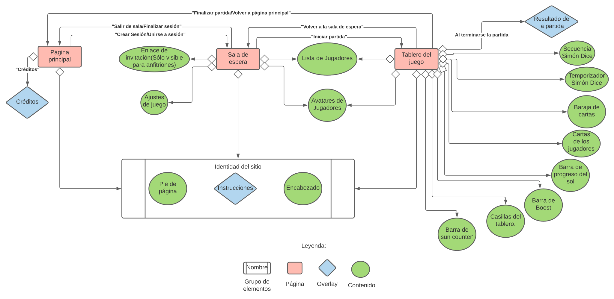
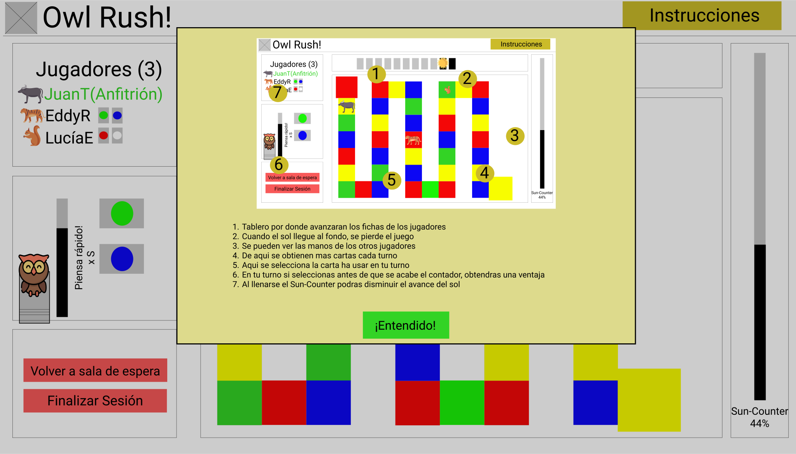

# Mapa de sitio.
1. Página principal.
    1. Desde ella se accede a los overlays Créditos e Instrucciones.
  
    2. Desde ella se puede acceder a la sala de espera como anfitrión que organiza o como invitado que ingresa

    3. Para que un usuario invitado se una a sesión utiliza un link mandado por el anfitrión, ingresando por el navegador. 

    4. Cuando usuario invitado oprime el botón Unirse a una sesión, saldra un overlay que en caso de que queden campos para más jugadores le pide que use el link en el navegador, en caso de que la sesión ya no le quedan cupos le saldrá un overlay que le dice que ya está llena la sala. 

2. Sala de espera.
    1. Desde ella se accede al tablero para todos los jugadores que se hayan unido a la sesión, cuando el 
    anfitrión haga click en Iniciar partida.
    
    2. Desde ella se accede a los overlays Ajustes de juego e Instrucciones.
    
    3. Desde ella se puede regresar a la página principal. (Haciendo click en Finalizar sesión en el caso de anfitriones o en Salir de la sesión en el caso de invitados)

3. Tablero de juego.
    1. Una vez en el juego, el anfitrión puede volver a la sala de espera en caso de quiera hacer algún ajuste adicional. También volverá a la sala de espera junto con el resto de jugadores si hace click en Jugar de nuevo cuando se acaba la partida.
    
    2. El anfitrión y sus invitados volverán a la pagina principal si el primero hace click en Finalizar partida en cualquier momento o a Volver al menú principal cuando se acabe la partida.
    
    3. Desde él se accede a los overlays Resultado de la partida (que aparece cuando se acaba el juego) e Instrucciones.

# Explicación: Diseño de wireframes

## Inicio
- En esta pantalla el usuario puede navegar a los otros sitios que se encuentran en la página. 

- El usuario va a poder escoger entre: crear una sesión nueva o unirse a una sesión ya existente.

- El usuario también podrá consultar los créditos del juego.

- El usuario puede consultar en cualquier momento las instrucciones para el menú principal. 

## Créditos
- En este overlay se despliega información acerca del juego, quiénes son los integrantes del equipo de desarrollo y de dónde se tomaron algunos recursos de la página. 

## Instrucciones de Menú de inicio
- En este overlay se muestran las instrucciones para el menú de inicio.

## Sala de espera

- El anfitrión usaría el botón "Copiar" para copiar su invitación y compartirla con otros jugadores.

- En esta vista de sala de espera, están habilitados los ajustes del juego, que le permitirán al anfitrión ajustar las reglas del juego a su gusto. Al lado de cada ajuste, está el botón de duda. Este mostrará una breve descripción sobre el ajuste que tenga al lado. En orden de arriba hacia abajo, cada ícono con ? desplegaría una de las siguientes ayudas:
    1. "Da click en "Copiar" para poder copiar el enlace de invitación. Tus amigos necesitarán este enlace para unirse a tu sala de espera"
    2. "Sun Counter es una habilidad especial que, cuando está llena, te permitirá anular una carta sol. Si no quieres jugar con esta habilidad, pon 0 en "Segundos de gracia de sun counter's boost"" 
    3. "Sun Counter's Boost es la recarga para tu barra sun counter que puedes ganar al tomar una carta en cada turno. Ajusta el tiempo total que tomará tu sun counter's boost en vaciarse con este parámetro. Si deseas deshabilitar "
    4. "Ajusta la barra de la derecha para establecer cuánto será el porcentaje inicial que tu sun counter's boost tendrá justo después de que tomes una carta"
    5. "Al elegir qué carta de tu mano usar en tu turno, el juego te mostrará una serie de colores que tendrás que memorizar para concretar tu movimiento. Si prefieres jugar sin esta mecánica, pon 0 en "Segundos de gracia de Simón Dice""
    6. "Ajusta el tiempo que tendrás para replicar la secuencia de colores que se muestra en pantalla cuando elijas qué carta de tu mano usar."
    7. "Ajusta cuántos colores tendrás que memorizar cada vez que brinque una secuencia de Simón Dice. Si eliges 0, la cantidad de pasos subirá conforme avance la partida. Si eliges -1, el número de pasos subirá o bajará dependiendo de las veces que falles o aciertes."
    8. "Decide qué castigos deseas definir para aquel que falle la secuencia de Simón Dice."
    9. "Decide si deseas hacer que todos los jugadores usen las mismas cartas."

- La sección de ajustes se divide en ajustes para Sun Counter y Simón Dice. En la sección de Simón Dice, hay una configuración que reza "Penalización por fallar". Esta configuración permite al usuario definir qué castigos ocurren cuando se falla la secuencia de Simón Dice. El jugador tiene la elección de habilitar todos los castigos, sólo unos cuantos, o uno. Hasta el momento de redactar esta sección, hay 3 penalizaciones consideradas:
    1. Perder turno: El turno del jugador se acaba y su avatar no realiza avance alguno.
    2. El sol avanza un paso: El efecto de una carta sol aparece y el sol se acerca un paso más al final.
    3. Perder Sun Counter's boost: El jugador pierde el boost que había ganado por decidir su carta mientras aún había Sun Counter's boost.

- Luego de la sección de penalización por fallos de Simón Dice, sigue la configuración de Mano Compartida. Este ajuste permite al anfitrión definir si desea hacer que todos los jugadores compartan sus cartas o hacer que cada quién tenga su propia mano. Cabe destacar que esta funcionalidad es de muy baja prioridad para el proyecto. 

- El anfitrión usaría el botón "Iniciar partida" para comenzar a jugar.

- En la esquina superior derecha se encuentra el botón de Instrucciones. Al hacer click, el anfitrión verá las instrucciones para anfitrión de la sala de espera. 

- En la esquina inferior izquierda está el botón "Finalizar Sesión", que le permite al anfitrión terminar la sesión. Debido a que se termina la sesión, cada jugador invitado recibiría una alerta que les indicara que la sesión ya no está disponible. Una advertencia le avisaría al anfitrión que si finaliza la sesión, cada invitado sería sacado de la sala y le pediría al anfitrión que confirme si está de acuerdo.

- El listado en la derecha indica cuántos jugadores se han unido a la sesión, junto con sus nombres de usuario. El anfitrión podrá expulsar a cualquier invitado en cualquier momento al hacer click sobre el círculo rojo al lado del nombre del jugador. Al hacer click sobre el círculo, una advertencia surgiría en la pantalla del host para solicitarle confirmación de la expulsión.

- Al unirse un invitado, este sería capaz de ver los ajustes de juego que hiciera el anfitrión. Sin embargo, no sería capaz de alterar algún ajuste ni de iniciar la partida, todos estos botones estarían deshabilitados para el invitado. El enlace de invitación sería remplazado por un aviso que dijera "Sólo el anfitrión puede cambiar ajustes de juego e iniciar la partida", en color rojo. Por otro lado, al igual que el anfitrión, el invitado sí tendría el botón de instrucciones activo todo el tiempo, aunque con instrucciones distintas con respecto al anfitrión. Un invitado tendrá la capacidad de abandonar la sala de espera cuando lo desease.

- Cuando la sala se haya llenado con 6 jugadores, el juego no admitirá más participantes. Aquellos que se intenten unir se toparán con un mensaje de error que les indique que ya no hay espacios disponibles en la sala de espera.

## Instrucciones para anfitrión
- Así es el overlay que se desplegaría al anfitrión cuando consultase las instrucciones. Esta pantalla explicaría paso por paso lo que el anfitrión debe hacer para comenzar a jugar

## Tablero
- La barra sun-counter y su progreso actual se encuentra a la izquierda.

- En la esquina inferior izquierda, se encuentra el tiempo que posee el usuario para tomar una decisión, así como la cantidad de progreso de sun counter que tomará al terminar su movida.

- Las casillas  en el centro representan las casillas del tablero. Las cajitas con x representan a los búhos al comienzo de la partida.

- Las barritas a la derecha indican el progreso del sol.

- En la parte inferior de la pantalla están las cartas que el jugador posee, así como la baraja de cartas de donde el jugador toma al inicio de cada turno.

- A la derecha, se encuentran los jugadores unidos a la partida, con sus respectivas cartas.

- Una cajita de checkbox debajo de la baraja de cartas permitirá al anfitrión elegir si desea hacer que todos los jugadores usen la misma mano de cartas en la partida. Esto sólo se puede habilitar al comienzo de la partida.

## Instrucciones para tablero de juego
- Este overlay aparecerá en pantalla cuando el jugador dé click en Instrucciones desde el tablero de juego. Este overlay explica parte por parte el la pantalla del tablero.

## Resultados finales
- Un mensaje se desplegará en pantalla, acompañado de una imagen, para indicarle a los jugadores si ganaron o perdieron.

- El jugador tendrá la posibilidad de de volver a jugar otra partida o de volver al menú principal.

